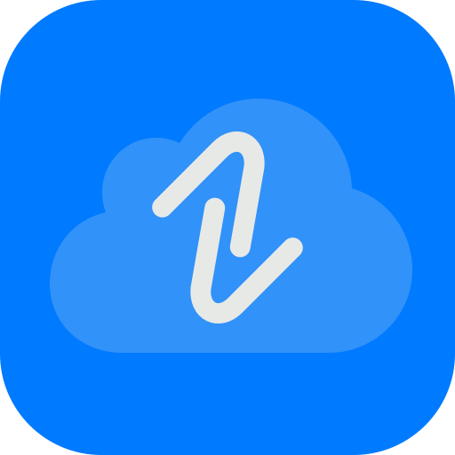

# Support

> [!IMPORTANT]
> DistilledLink requires **iOS 26 or later**.

For help with DistilledLink:

- [Report a bug or suggest a feature](/../../issues).
- Email the developer at [distilledlink@danemacmillan.com](mailto:distilledlink@danemacmillan.com).

## Development notes

DistilledLink is my first iOS app. After 18 years of web development experience, I finally found the time in 2026 to learn Swift and SwiftUI and pursue a long-standing interest in building apps for Apple platforms.

I deliberately chose iOS 26 as the minimum supported version to keep development and testing manageable while focusing on modern platform capabilities and the app’s future development.

---

  

  <a href="README.md">Home</a> ·
  <a href="PRIVACY.md">Privacy Policy</a> ·
  <a href="TERMS.md">Terms of Use</a> ·
  <a href="SUPPORT.md">Support</a>

